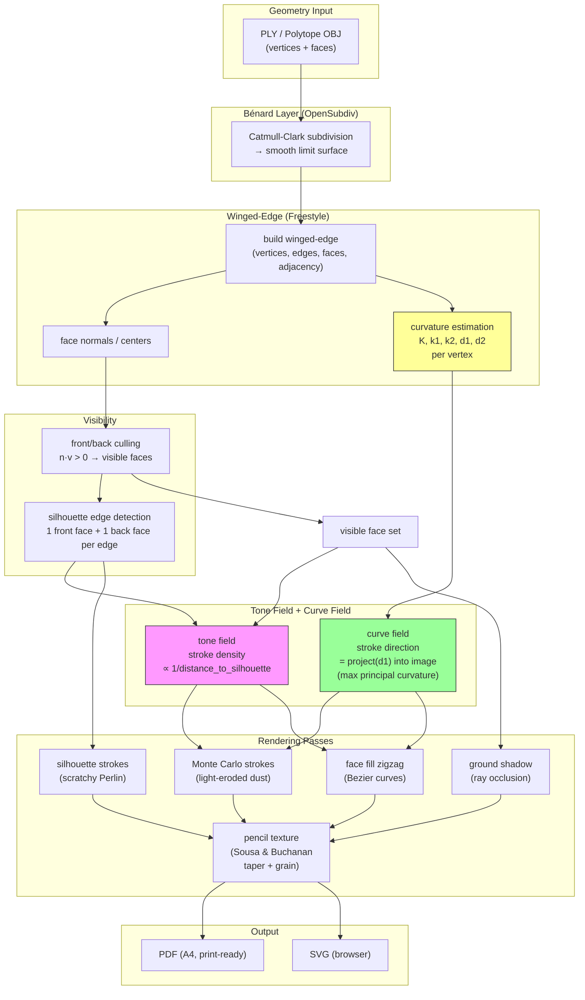

**Tone field** (pink): stroke density driven by silhouette proximity — lines gather where the form turns away.  
**Curve field** (green): stroke direction driven by d1 — lines follow the surface's natural grain.  

The missing link (yellow): curvature estimation on the limit surface. `freestyle/winged_edge/Curvature.cpp` exists but only computes per-face neighbor normal variance. Needs upgrading to full K, k1, k2, d1, d2.
